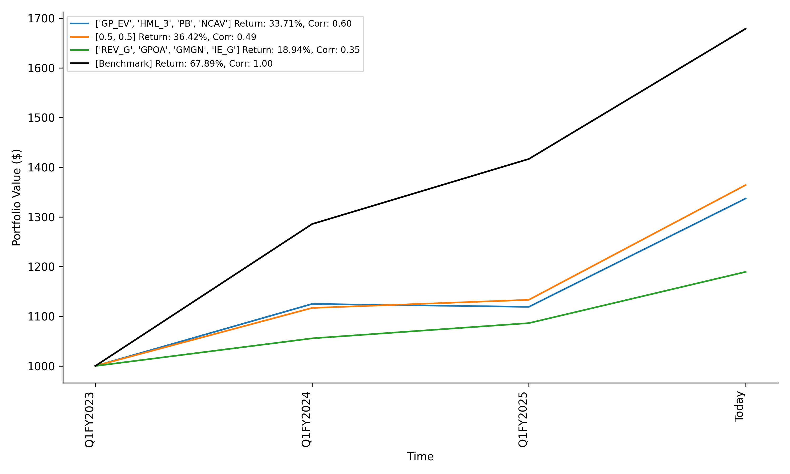
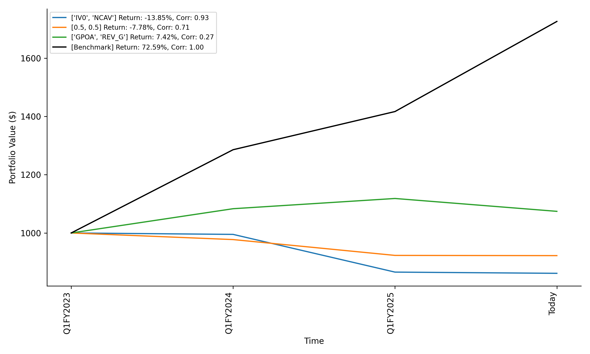
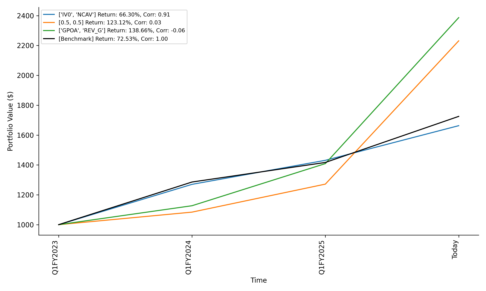
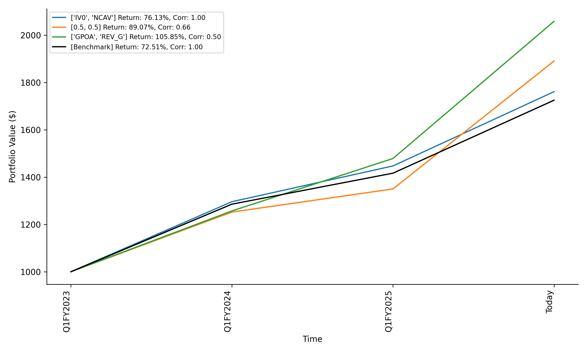
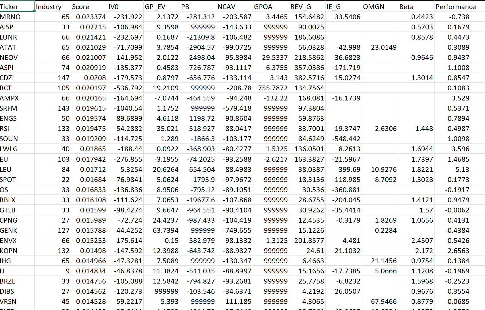

Proof of concept, so backtest architecture and everything is bad.  
Performance/backtest results are a step function(so vol laundering), limited lookback period, limited combination tested, etc.  
Limited linear comb of factors tested for shorter run time and overfitting. Tested year by year so allow out of sample and live testing.  

# Backtest 
performance

data

# Backtest Old
Long+Short

Long Only

Long Only2

# Data
FY2025 Rank

